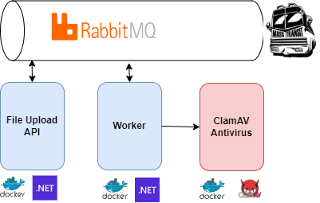

# Antivirus scan with .Net 7 and ClamAV
This is an example of how to analyze uploaded files with .Net 6 using ClamAV and RabbitMQ




The whole solution consists in 4 containers:
1. **File Upload API Container**: This is the way we interact with the user, the API puts the file into a shared volume for post-analysis and push a message with the file's location to the queue, so it can be analyzed later by the workers and the user doesn't have to wait for the scan.
2. **RabbitMQ Container**: This is the message broker used for this demo and communicates the File Upload API and the Worker.
3. **Worker Container**: It takes the messages from the queue, loads the file into memory a sends it to the antivirus through the network. This container shares the same volume than File Upload API Container. In case that files are too large, we can share the same volume with the antivirus container and just specify the path instead of sending the whole file. As soon as the file scan result are available, the worker sends a message through the queue to the API so it can process that information and notify the user that the file has been scanned.
4. **ClamAV Container**: It's and open source antivirus maintained by Talos, the treat intelligente team of Cisco Systems. More info [here](https://docs.clamav.net/)

Using this arquitecture, whe can replicate as much as we need the workers and APIs to handler more traffic.


## Requirements
- Docker installed
- At least 4GB or RAM, this is because ClamAV load the signature definitions in RAM and once a day it checks for updates. You can get more information of how it works [here](https://docs.clamav.net/manual/Installing/Docker.html)


## Starting the project
```code
# Build the project
docker-compose build

# Start the project
docker-compose up
```


## docker-compose file
```yaml
version: '3.4'

services:
  antiviruscheck.api:
    image: ${DOCKER_REGISTRY-}antiviruscheckapi
    hostname: api
    container_name: api
    environment:
        - RabbitMQ_Address=rabbitmq://host.docker.internal
        - RabbitMQ_User=guest
        - RabbitMQ_Pass=guest
        - FilePath=/filedata/
    build:
      context: .
      dockerfile: AntivirusCheck.Api/Dockerfile
    volumes:
        - files-directory:/filedata/

  antiviruscheck.worker:
    image: ${DOCKER_REGISTRY-}antiviruscheckworker
    hostname: worker
    container_name: worker
    environment:
        - RabbitMQ_Address=rabbitmq://host.docker.internal
        - RabbitMQ_User=guest
        - RabbitMQ_Pass=guest
        - FilePath=/filedata/
        - ClamAV_Address=host.docker.internal
        - ClamAV_Port=13310
    build:
      context: .
      dockerfile: AntivirusCheck.Worker/Dockerfile
    volumes:
        - files-directory:/filedata/

  ClamAV:
    image: clamav/clamav:latest
    hostname: clamavserver
    container_name: clamavserver
    ports:
        - 13310:3310
        - 7357:7357

  RabbitMQServer:
    image: rabbitmq:3-management
    container_name: RabbitMQServer
    ports:
        - 15672:15672
        - 5672:5672

volumes:
  files-directory:
    external: false
```
